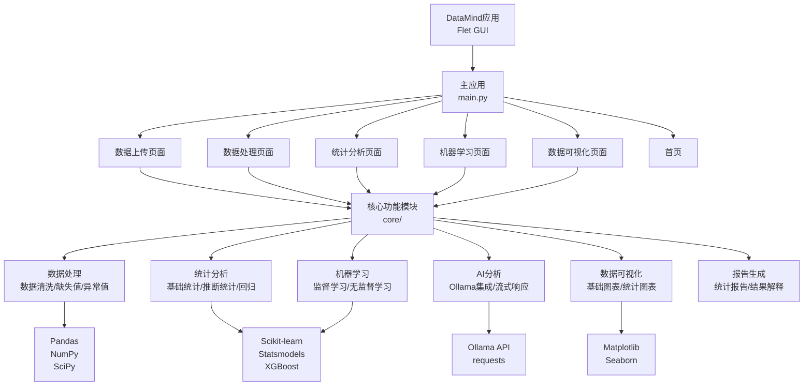

# DataMind - 数据分析平台

一个功能完整的数据分析和统计建模平台，参考 SPSSPRO 设计，提供从数据管理到高级机器学习的全流程分析能力。

## ✨ 主要特性

- 📊 **数据管理**: 数据上传、清洗、转换、质量评估
- 📈 **统计分析**: 描述性统计、假设检验、回归分析、时间序列分析
- 🤖 **机器学习**: 监督学习、无监督学习、模型评估与优化
- 📉 **数据可视化**: 丰富的图表类型和统计图表
- 🧠 **AI自动分析**: 使用本地Ollama模型智能分析数据，提供处理建议和可视化方案（支持流式响应）
- ♿ **无障碍访问**: 严格遵循WCAG 2.1 AAA级标准

## 🏗️ 系统架构



## 📦 项目结构

```
DataMind/
├── core/                      # 核心功能模块
│   ├── data_processor.py      # 基础数据处理
│   ├── data_enhancement/      # 数据增强
│   ├── statistics/            # 统计分析
│   ├── ml/                    # 机器学习
│   ├── ai/                    # AI自动分析（Ollama）
│   ├── visualization/         # 数据可视化
│   └── reporting/             # 报告生成
├── ui_flet/                   # Flet用户界面
│   ├── pages/                 # 页面组件
│   ├── components/            # UI组件
│   ├── styles.py              # 样式定义
│   └── utils/                 # UI工具
├── main.py                    # 入口文件
└── requirements.txt           # 依赖列表
```

## 🚀 快速开始

### 环境要求

- Python 3.8+
- Windows 10/11

### 安装步骤

#### 使用 Conda 环境（推荐）

**环境配置说明：**
- 系统已配置为统一使用 D 盘的 conda 环境（`D:\Miniconda\envs`）
- 所有 conda 环境都存储在 D 盘

**使用方法：**

**方式1：使用 conda activate**
```cmd
C:\Users\32834\miniconda3\Scripts\conda.exe activate data_preprocessing
python main.py
```

**方式2：直接使用 Python 解释器（无需激活）**
```cmd
D:\Miniconda\envs\data_preprocessing\python.exe main.py
```

**方式3：PowerShell**
```powershell
conda activate data_preprocessing
python main.py
```

#### 手动设置

1. **创建虚拟环境**
```bash
python -m venv venv
```

2. **激活虚拟环境**
```bash
# Windows
venv\Scripts\activate
```

3. **安装依赖**
```bash
pip install --upgrade pip
pip install -r requirements.txt
```

4. **运行应用**
```bash
python main.py
```

## 📋 依赖库

### 核心依赖
- `pandas` - 数据处理
- `numpy` - 数值计算
- `scipy` - 科学计算
- `scikit-learn` - 机器学习
- `statsmodels` - 统计建模

### 可视化
- `matplotlib` - 图表绘制
- `seaborn` - 统计图表

### AI分析
- `flet` - 现代化UI框架
- `requests` - Ollama API调用

### 可选依赖
- `xgboost` - 梯度提升算法
- `umap-learn` - 降维算法

## 🎯 主要功能

### 数据管理
- CSV/Excel 文件上传
- 数据预览和探索
- 缺失值处理（多种方法）
- 异常值检测和处理
- 数据转换和特征工程

### 统计分析
- **描述性统计**: 均值、方差、分位数等
- **假设检验**: t检验、卡方检验、非参数检验
- **回归分析**: 线性回归、逻辑回归、逐步回归
- **时间序列**: ARIMA、指数平滑、平稳性检验
- **多变量分析**: 因子分析、判别分析、典型相关

### 机器学习
- **监督学习**: SVM、KNN、神经网络、集成学习
- **无监督学习**: DBSCAN、谱聚类、GMM、降维
- **模型评估**: 交叉验证、超参数优化、模型对比

### 数据可视化
- 基础图表（柱状图、折线图、散点图等）
- 统计图表（密度图、Q-Q图、残差图等）
- 图表导出（PNG、PDF、SVG）

### AI自动分析
- **前置条件**: 确保已安装并运行 Ollama，且已下载 `qwen3-vl:235b-cloud` 模型
- 上传数据后自动触发AI分析
- 流式响应，实时显示分析结果
- 提供数据质量评估、处理建议、可视化方案和统计分析方向

**Ollama配置说明**:
1. 安装 Ollama: 访问 https://ollama.ai 下载并安装
2. 下载模型: 运行 `ollama pull qwen3-vl:235b-cloud`
3. 启动服务: Ollama 默认运行在 `http://localhost:11434`
4. 如果使用不同的模型或端口，可在 `core/ai/ai_analyzer.py` 中修改配置

## 📖 使用示例

### 1. 数据上传
- 点击"数据上传"页面
- 选择 CSV 或 Excel 文件
- 查看数据预览，AI自动分析将自动触发

### 2. 数据处理
- 进入"数据处理"页面
- 选择处理步骤（缺失值、异常值、编码等）
- 配置参数并执行

### 3. 统计分析
- 进入"统计分析"页面
- 选择分析类型（描述性、假设检验等）
- 选择变量并执行分析
- 查看结果表格、报告和解释

### 4. 机器学习
- 进入"机器学习"页面
- 选择算法类型（监督/无监督）
- 选择目标变量和特征变量
- 配置参数并训练模型
- 查看模型性能指标

### 5. 数据可视化
- 进入"数据可视化"页面
- 选择图表类型
- 选择变量并生成图表
- 导出图表

## 🔧 开发规范

- **文件大小**: 单个文件不超过 500 行
- **代码规范**: 遵循 PEP 8
- **代码复用**: 提取公共方法和工具类
- **模块化设计**: 功能分离，便于维护

## ♿ 无障碍访问（WCAG 2.1 AAA级标准）

DataMind 严格遵循 **WCAG 2.1 AAA级**（最高级别）无障碍访问标准：

### 视觉设计
- **高对比度文字**：所有文字颜色与背景的对比度达到WCAG AAA级标准（至少7:1）
- **清晰的视觉层次**：使用统一的字体大小系统
- **一致的间距系统**：标准化的间距规范

### 交互设计
- **明确的焦点指示**：所有可交互元素都有清晰的焦点状态
- **合理的点击区域**：按钮和交互元素尺寸符合最小点击区域要求
- **友好的错误提示**：使用SnackBar和AlertDialog提供清晰的反馈信息

### 代码规范
- **语义化组件**：使用语义化的组件名称和结构
- **键盘导航支持**：所有功能支持键盘操作
- **屏幕阅读器友好**：组件属性支持辅助技术识别

## 📝 开发计划

项目持续开发中，欢迎贡献代码和提出建议。

## 📄 许可证

[待定]

## 👥 贡献

欢迎提交 Issue 和 Pull Request！

---

**最后更新**: 2025年12月2日
